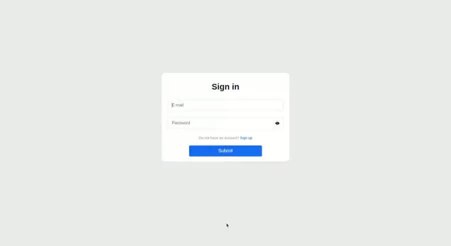
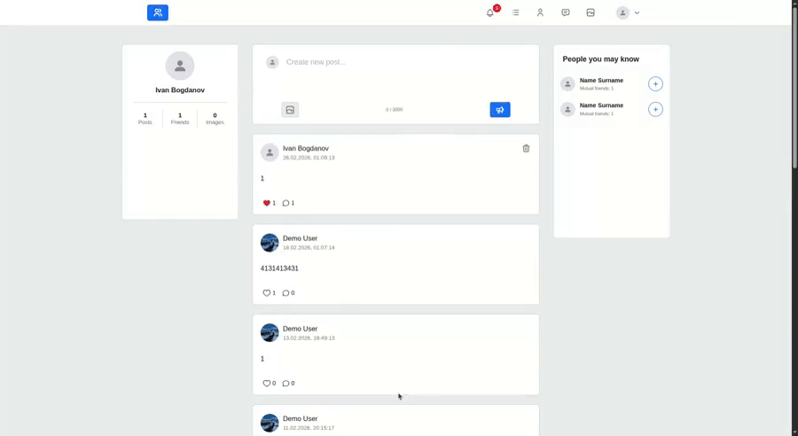
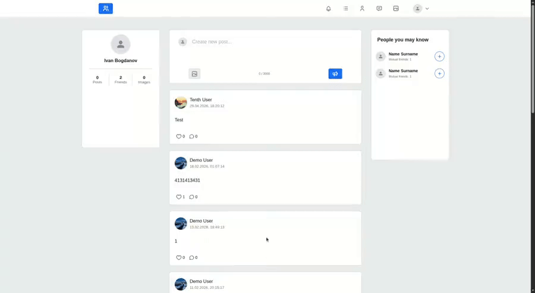
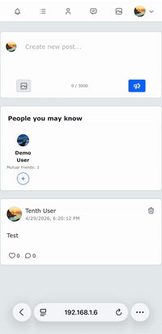

# Social Network

A fullstack social networking platform built with the MERN stack, featuring real-time communication, user interactions, and content sharing.

## Features

- User authentication and profile system
- Connect with other users
- Create and share posts
- Real-time chat and messaging
- Live notifications

## Tech Stack

- **Frontend**: React, Bootstrap CSS
- **Backend**: Node.js, Express.js
- **Authentication**: JWT
- **Testing**: Jest, Supertest
- **Database**: MongoDB
- **Validation**: express-validator
- **Real-time**: Socket.io
- **Containerization**: Docker

## Installation

```bash
git clone https://github.com/ssh319/social_network.git
cd social_network

# Backend
cd server
npm install

# Frontend
cd ../client
npm install
```

## Usage

### Production

```bash
docker compose build
docker compose up -d
```

### Development

Run backend:
```bash
cd server
NODE_ENV=development node server.js
```

Run frontend:
```bash
cd client
npm start
```

Testing:
```bash
cd server
npm test
```

## License

MIT

## Demo

### Authentication


### Messaging


### Feed & Notifications


### Mobile version

